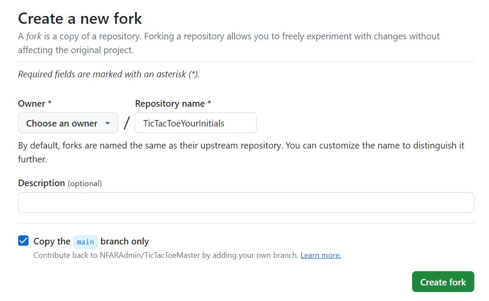

# Tic Tac Toe
You will be referencing this [Tic Tac Toe](https://www.codebrainer.com/blog/tic-tac-toe-javascript-game) exercise. It is well guided exercise that will provide you with the building blocks for a basic Tic Tac Toe game. There are some important changes to the instructions that they provide. Since each person will be working on their own html page, CSS stylesheet, and javascript we need to make sure you have your own. Please follow the steps below before getting started.    

 
### 1. Fork the repository
First step will be to fork this repository. While cloning and forking create copies of a repository, the level of control each one provides is different. Cloning will remain synchronized with the original repository, while forking will not. When you fork a repository it will create a copy in your account. Once the repository is in your account, then you will clone it to your local computer. You can submit a pull request later on if you wish to contribute to the original repository, but it is not necessary.     

Fork is not a Git operation — which means there is not a terminal command you can type to execute it. This is a feature that is exclusive to remote hosting platforms, such as GitHub.

Navigate to the repository and click on the fork button toward the top: 
 

You will choose your own account as the owner and add yout initials at the end of TicTacToe (i.e. TicTacToeIE). Enter a description of the repository for future reference. 
 

### 2. HTML, TTTstyles.css, ans Script.js Page:
One you have cloned the repository and created working branch open VS Code. Unlike the home page that everyone worked on, in this exercise will have three files to work on. The nameTicTacToe.html will be your html. You will rename this file (while in VS Code use CTRL + C, then CTRL + V) and rename it by using your first and last name initial. So "Jane Doe" will copy the nameTicTacToe.html file and rename it **jdTicTacToe.html**. 

Do the same for the **TTTstyles.css** and **script.js**. Make sure to copy and rename. So "Jane Doe" will have three files:

```js
jdTicTacToe.html
jdstyle.css
jdscript.js
```
In **your** html file you will have to change the link to the css and javascript file. 

```js
<!DOCTYPE html>
<html lang="en">
<head>
 <meta charset="UTF-8">
 <meta http-equiv="X-UA-Compatible" content="IE=edge">
 <meta name="viewport" content="width=device-width, initial-scale=1.0">
 <link rel="stylesheet" href="styles.css"> <!-- DO NOT CHANGE THIS LINK -->
 <link rel="stylesheet" href="TTTstyles.css">  <!-- Change file name here to point to your file -->
 <script src="script.js" defer></script>            <!-- Change file name here to point to your file -->
 <title>Tic-Tac-Toe - CodeBrainer</title>
</head>
```
### 3. Follow along with exercise: 
Before you get started, make sure you are on your own branch (can't stress this enough). Now you can actually follow along with the [exercise](https://www.codebrainer.com/blog/tic-tac-toe-javascript-game). 

As you follow along on the exercise make sure to preview your work to see how you are doing. This way you can catch any bugs before the end. 

Feel free modify your CSS file to style it the way you want. It should only affect your Tic Tac Toe html page. 

When your game is working you are ready to link it to your card in the home page.

### 4. Rename the Tic Tac Toe html page:
Toward the top of your html page make sure use your name. 

```js
 <div id="welcome">Welcome to "YOUR NAME" Tic Tac Toe</div> 
```
Looks like you're done 😊

### [Next - Step 3: Linking to the Home Page:](3_LinkToYourCard.md)

